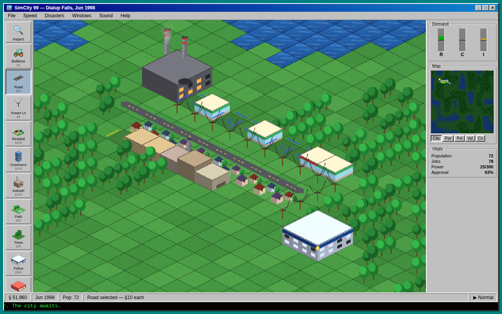

# 🏙️ SimCity 99 — The 1997 Edition

> *It's January 1997. Dolly the sheep just got cloned, Deep Blue is warming up,
> and a 56k modem screams somewhere down the hall. You've just been elected Mayor.*

A retro isometric city-builder in the spirit of the classic 90s greats, running
entirely in the browser. **Zero dependencies, zero build step, zero asset files** —
every sprite is drawn procedurally on `<canvas>` at boot, and every sound effect
is synthesized live with WebAudio.

## ▶ Play

**Play it now (single-file build):**
[SimCity 99 on Claude Artifacts](https://claude.ai/code/artifact/11662dcc-e0db-4051-af9a-302d54c7c504)
*(private by default — shareable from the page's share menu)*

Or run it locally: open `index.html` in a browser. That's it. (Or serve the
folder: `python3 -m http.server` → http://localhost:8000)

## ✨ Features

### The city
- **Isometric engine** — painter's-order renderer with a **90° view rotation**
  (press `Q`/`E` to spin the city through all four angles), a cached flat-terrain
  layer for big maps, smooth pan and zoom
- **Pick your map** — 64 Village / 80 Classic / 128 Megalopolis, with a live
  terrain preview and reroll on the splash screen
- **The classic loop** — zone Residential / Commercial / Industrial and watch
  lots develop through three density levels driven by a live RCI demand model
- **Power grid** — coal, solar, gas and wind plants (each with its own output,
  smog and upkeep; fossil plants *age* and lose capacity), power lines, and
  **power lines that cross roads** — lay a wire over a road (or a road over a
  wire) to make a crossing that carries traffic *and* conducts power
- **Traffic** — per-road congestion from zone trips, animated cars that thread
  the streets (and honor the game speed), road wear, and a news **traffic
  helicopter** that flies to the worst jam and files a report you can click
- **City services** — police & fire stations, schools & hospitals with powered
  coverage radii that raise land value, juice demand, and gate top-density growth
- **Water, land, life** — pollution diffusion, land value and crime maps, all
  viewable as minimap overlays (City / Power / Pollution / Value / Crime /
  Traffic / Services), each with its own legend and a live camera box

### Running the government
- **Budget & departments** — monthly taxes, an adjustable tax rate, and per-
  department funding sliders (police, fire, roads, education, health) that trade
  service quality against the treasury; roads decay when starved
- **Advisors with attitude** — Finance, Safety, Environment and Transportation
  advisors read the live sim and react to your policies with department bias —
  cut taxes and Public Works throws a fit; over-tax and everyone warns you the
  city will empty out
- **Bonds & loans** — issue municipal bonds, watch the debt service, and earn a
  live AAA–C credit rating that prices your next bond
- **Milestones & City Hall** — population tiers with tabloid promotion papers and
  reward buildings, plus a City Hall almanac of every year's population, taxes,
  budget and disasters, and named citizen complaints you can click to fly to

### The world in motion
- **Day/night cycle** — deterministic dawn/dusk with lit windows, street lamps
  and night-amplified disaster glow (toggleable)
- **Seasons** — snowed-under winters with icy shores, plowed roads and lighter
  traffic; spring blossom; autumn foliage; season-flavored headlines
- **Disasters** — fires that spread (build fire coverage!), tornadoes, and a UFO
  visit — it *is* the 50th anniversary of Roswell, after all
- **Scenarios & medals** — hand-built challenge cities (Gridlock '97, Twister
  Season, Blackout Summer, Y2K Ready) with gold/silver/bronze cutoffs and a
  trophy shelf
- **Time capsule '97** — a news ticker that follows the real 1997–1999 timeline
  month by month (Hale-Bopp, Pathfinder, Tamagotchi, that boat movie…), with
  dated events that actually nudge the sim

### Extras
- **Postcard mode** — compose the live viewport into a 1997 airmail postcard and
  save it as a PNG
- **Touch & small screen** — one-finger build, two-finger pan, pinch zoom, and a
  responsive tablet layout
- **Sound** — a generative lo-fi chiptune bed and fully synthesized SFX (no audio
  files), plus zoom-in ambient soundscapes
- **Save / load** — autosaves to `localStorage` every 45 seconds

## 🎮 Controls

| Input | Action |
|---|---|
| Left click / drag | Use the selected tool |
| Right or middle drag | Pan the map |
| Mouse wheel | Zoom |
| `Q` / `E` (or `[` / `]`) | Rotate the view 90° |
| `Space` | Pause / resume |
| `Speed` menu | Pause · Turtle · Llama · Cheetah |
| Arrow keys | Pan |
| `F1` | Full shortcut & tool list |
| One finger / two fingers / pinch | Build / pan / zoom (touch) |

Tools live on the toolbar (roads, power, zones, parks, water, police, fire,
schools, hospitals, four kinds of power plant, and tier-unlocked reward
buildings), each with a number/letter hotkey shown in the `F1` overlay.

## 🗂️ Code tour

| File | What it does |
|---|---|
| `js/sim.js` | Simulation: terrain gen, zoning, growth, power flood-fill, traffic, pollution/value/crime diffusion, budget & departments, disasters, save/load |
| `js/sprites.js` | Procedural sprite factory — every tile, building, road and season drawn in code |
| `js/render.js` | Isometric renderer: rotation, camera, day/night, cars, smoke, disaster FX, minimap |
| `js/ui.js` | Win95 UI: toolbar, menus, dialogs, input, minimap overlays, 1997 news ticker |
| `js/advisors.js` | The advisor panel and its department-biased reactions |
| `js/scenarios.js` | Declarative challenge scenarios, goals and medals |
| `js/postcard.js` | Postcard photo composer |
| `js/ambience.js` | Zoom-in ambient soundscapes |
| `js/audio.js` | WebAudio synth: all SFX + the generative background music |
| `js/main.js` | Boot + fixed-timestep game loop |

Design specs and success criteria for in-progress and queued features live in
`docs/` (`rotation-design.json`, `queue-specs.json`) and the milestone log is
`MILESTONES.md`.

## ⚖️ A note on assets

This project was inspired by the look, feel, and sound design of *SimCity 2000*
(and by the [OpenSC2K](https://github.com/nicholas-ochoa/OpenSC2K) engine
reverse-engineering effort). It deliberately contains **no Maxis/EA assets** —
no ripped sprites, no ripped sounds. Everything visual is generated by
`js/sprites.js` and everything audible is synthesized by `js/audio.js`, so the
repository is 100% original code. *SimCity* is a trademark of Electronic Arts;
this is a non-commercial fan homage.
